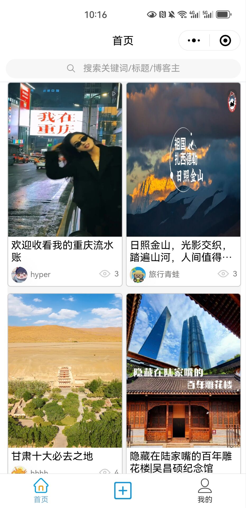
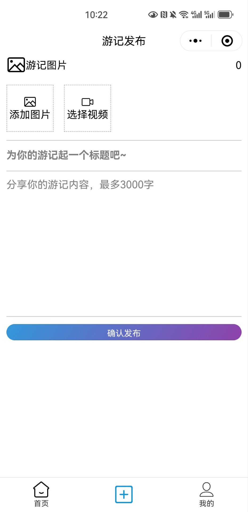

# 旅游日记平台

## 简介

本项目基于 Taro 实现了微信小程序版本的旅游日记平台。

## 快速开始

`npm install`安装所有依赖

`npm run dev:weapp`运行小程序

## 项目概览

### 1.首页

- 首页展示瀑布流游记卡片列表，下拉到底无限滚动。
- 点击图文游记卡片可跳转至详情页。
- 点击视频游记卡片可跳转至视频页。
- 点击上方搜索可跳转至搜索页。

#### 1.1 详情页

- 详情页展示用户基本信息，可滑动的图文，下方可以进行点赞和分享。
- 点击用户头像可跳转至用户个人主页。

### 1.2 视频页

- 视频页自动播放视频，提供可滑动的无限视频流，可双击点赞和分享。
- 点击用户头像或用户名可跳转至用户个人主页。

#### 1.3 搜索页

- 搜索页根据关键词进行检索，展示有关的卡片列表以及用户信息。
- 搜索历史可保留可删除。
- 点击搜索记录可以直接跳转到对应搜索结果页。

### 2.发布页

- 未登录会跳转到登录页
- 发布页只可发布图片或者视频，且标题、内容为必填
- 发布后可跳转至我的游记页

### 3.我的页

- 我的页展示用户昵称和头像、用户发布的游记数和总浏览量
- 提供我的游记页、个人信息页、个人主页的跳转

### 3.1 我的游记页

- 我的游记页展示用户所有（未删除）的游记列表，并显示游记状态
- 支持用户对游记进行编辑、删除
- 提供发布页、编辑页的跳转

### 3.2 编辑页

- 支持用户对视频、图文进行更改

### 3.3 个人信息页

- 个人信息页支持用户对头像、昵称、密码进行编辑修改

### 3.4 个人主页

- 个人主页展示用户基本信息和动态信息

### 4.登录注册页

- 用户进行登录注册

